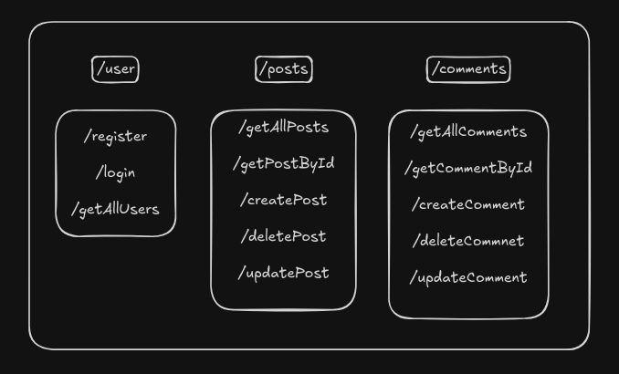

### Blog Backend API

This is the backend API for a blogging platform, allowing users to register, login, and perform CRUD operations (Create, Read, Update, Delete) on posts and comments.

### Tech Stack
- Node.js
- Express.js
- MongoDB
- Mongoose
- JWT

### Routes

